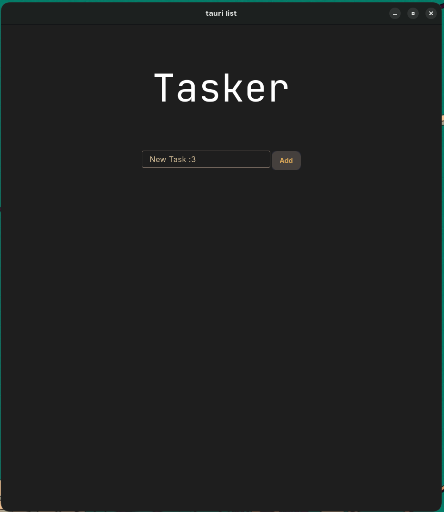

# tauri-list

A stupidly simple task tracker, "Tasker" — built because I wanted an excuse to mess with Tauri v2 and M3E's Material 3 Expressive components. Runs as a native desktop app (and Android, eventually) instead of yet another browser tab.



## Why

I wanted a todo list that actually looks like something, not a bootstrap starter template. Themed it with a Gruvbox Material Soft Dark palette on top of M3E's design tokens.

## Stack

- **Tauri v2** — native shell, tiny binaries
- **React + Vite** — frontend
- **@m3e/web** — Material 3 Expressive web components
- Gruvbox Material (Soft Dark) theming via CSS custom properties

## Install (prebuilt)

Grab the latest `.deb`, `.rpm`, or AppImage from [Releases](../../releases) and install directly — no need to build from source.

```bash
# deb
sudo dpkg -i tauri-list_*_amd64.deb

# rpm
sudo rpm -i tauri-list-*.x86_64.rpm
```

## Running it

```bash
npm install
npm run tauri dev
```

## Building

Desktop:

```bash
npm run tauri build
```

Spits out a `.deb`, `.rpm`, and (if `linuxdeploy` cooperates) an AppImage in `src-tauri/target/release/bundle/`.

Android (needs JDK 21 + Android Studio SDK/NDK set up first):

```bash
npm run tauri android init
npm run tauri android build
```

## Known rough edges

- AppImage bundling needs `linuxdeploy` + plugins on `PATH` — Tauri auto-downloads them to `~/.cache/tauri`, but you may need to symlink/chmod them yourself depending on distro.
- Bundle size warning on the JS chunk (~1.4MB) — haven't bothered code-splitting yet.

## License

MIT
